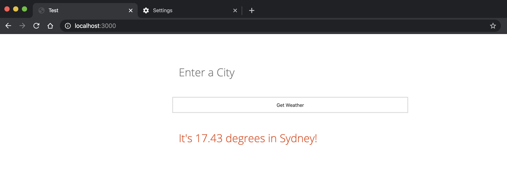

# simple-nodejs-weather-app
Simple Node.js Command Line Weather Application

* Check out the **[Live Demo](https://simple-nodejs-weather-app-irhhpddsku.now.sh/)**
* Read the full tutorial on how to build this application at [codeburst.io](https://codeburst.io)
## Run the web app locally
### Docker
Prerequisite
* [Install Docker](https://docs.docker.com/get-docker/)
```
docker build -t weather-app .
docker run -d -p 3000:3000 -e APIKEY=<put_your_api_key> --name weather-app weather-app
```
### Node:
```
node server.js
```
## Usage
```
// Now open your browser and visit: localhost:3000
```


## Output



